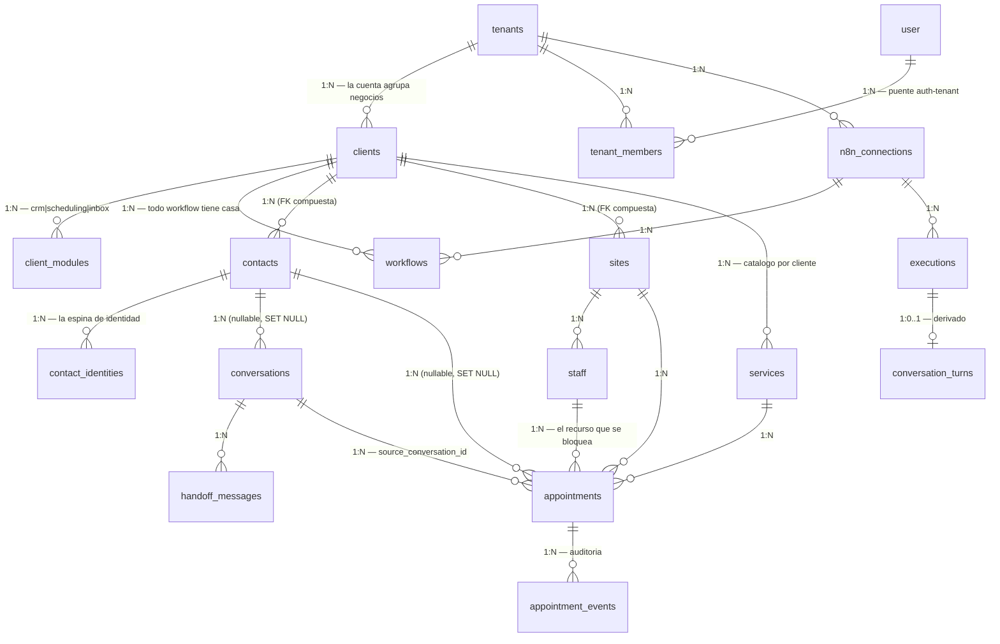
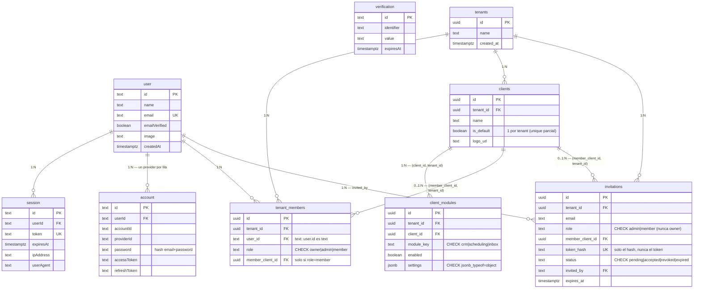
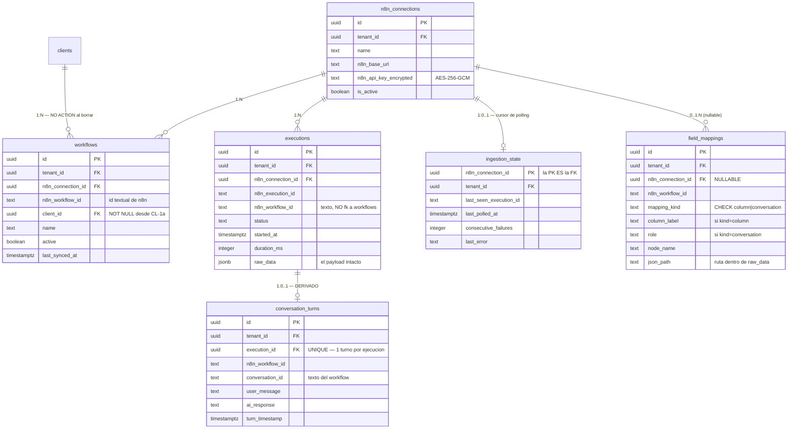
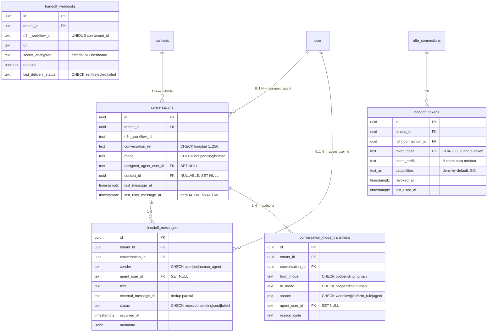
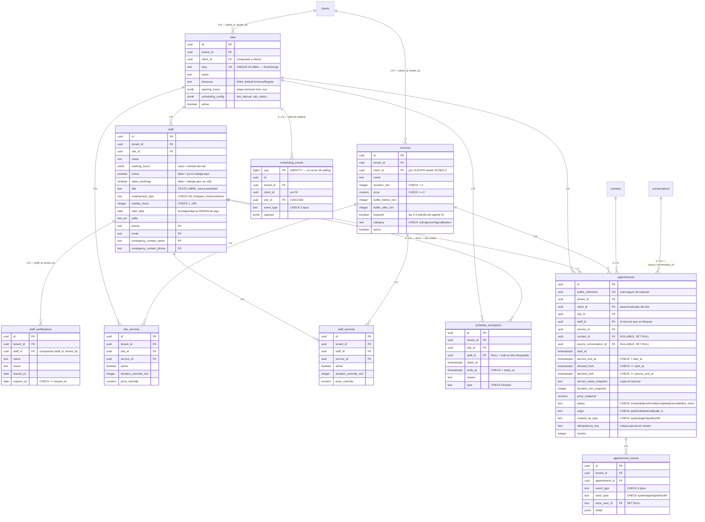

# Esquema de base de datos — MAI Observation Platform

> Documento generado a partir de las 31 migraciones en `migrations/` y de los
> repositorios en `src/db/repositories/`. No contiene datos de clientes ni
> credenciales. Última revisión contra `main` @ `b5a26b5`.

## Resumen (leer esto primero)

MAI es una **plataforma multi-tenant** que empezó como observabilidad de
automatizaciones [n8n](https://n8n.io/) y hoy es además el **sistema de registro
del CRM y de la agenda** de negocios de servicio presencial (barberías, salones).
Ingiere ejecuciones de n8n, reconstruye conversaciones, mantiene la ficha de cada
persona, y agenda citas con **doble-booking imposible a nivel de base de datos**
(un `EXCLUDE USING gist` en `appointments`).

El aislamiento tiene **dos niveles, no uno**: `tenant_id` es la cuenta (el techo
de todo) y `client_id` es el negocio dentro de la cuenta. Casi toda tabla de
dominio lleva **ambas** columnas, y la pertenencia se fuerza con **FKs compuestas**
(`(client_id, tenant_id) → clients(id, tenant_id)`) para que una fila no pueda
apuntar al cliente de otro tenant aunque la capa de aplicación se equivoque. No
hay Row-Level Security: el aislamiento es *estructural* (FKs compuestas) más
*disciplina de repositorio* (toda query filtra por `tenant_id`).

**Las 5 tablas centrales**: `tenants` (la cuenta), `clients` (el negocio dentro
de la cuenta — de él cuelgan los módulos y los datos), `contacts` (la persona
canónica), `appointments` (la cita, con la garantía anti-solapamiento), y
`conversations` (el hilo con estado bot→pending→human).

40 tablas en 5 dominios: identidad/tenancy (9), observabilidad n8n (6),
conversaciones/inbox (5), CRM (10), scheduling (10).

---

## Aislamiento por tenant (por qué los diagramas no dibujan `tenants`)

**Casi todas las 40 tablas tienen `tenant_id uuid NOT NULL REFERENCES tenants(id)
ON DELETE CASCADE.`** Dibujar esa arista 36 veces haría el diagrama ilegible, así
que **se omite en todos los diagramas por dominio**. Asúmase presente salvo en:

| Excepción | Por qué |
|---|---|
| `user`, `session`, `account`, `verification` | Tablas de Better Auth. Son globales; el puente al tenant es `tenant_members`. |
| `clients` (`client_modules`, `client_field_definitions`) | Tienen `tenant_id` pero su FK real es **compuesta** a `clients(id, tenant_id)` con `ON DELETE CASCADE`. |
| `ingestion_state` | PK es `n8n_connection_id`, no `id`. Sí tiene `tenant_id`. |
| `scheduling_events` | PK es `seq bigint` (cursor de polling). Sí tiene `tenant_id`. |

Reglas del modelo de aislamiento:

1. **Dos niveles.** `tenant_id` = la cuenta. `client_id` = el negocio dentro de
   la cuenta. Un usuario con rol `member` está **duro-limitado a un solo
   `client_id`** (`tenant_members.member_client_id`).
2. **FK compuesta = garantía estructural.** `clients` tiene
   `UNIQUE (id, tenant_id)` solo para poder ser destino de
   `FOREIGN KEY (client_id, tenant_id)`. Igual con
   `contacts UNIQUE (id, tenant_id, client_id)`, `staff UNIQUE (id, tenant_id)` y
   `contact_tags UNIQUE (id, tenant_id, client_id)`.
3. **Módulos por cliente.** `client_modules` decide qué superficies existen para
   cada negocio (`crm` | `scheduling` | `inbox`). **La ausencia de fila = módulo
   deshabilitado**; una fila con `enabled=false` conserva los settings apagados.
4. **`ON DELETE` no es uniforme y es a propósito.** Los datos de dominio hacen
   `CASCADE` al tenant; las referencias a `"user"` hacen `SET NULL` (borrar un
   usuario no puede borrar historial, solo pierde la atribución); y las FKs a
   `clients` son `NO ACTION` para **bloquear** el borrado de un cliente que
   todavía tiene datos.

---

## Diagrama de alto nivel

Solo las tablas ancla y los cruces entre dominios. `tenant_id` omitido.



**Los tres cruces entre dominios que importan:**

- `conversations.contact_id` — une inbox con CRM. **Nullable**: un hilo puede
  existir antes de resolver quién es la persona.
- `appointments.contact_id` + `appointments.source_conversation_id` — unen
  scheduling con CRM e inbox. Ambas nullable y `ON DELETE SET NULL`.
- `workflows.client_id` — une observabilidad con el modelo de negocio. Es
  `NOT NULL`: todo workflow pertenece a exactamente un cliente (el "default" del
  tenant si nadie lo asignó).

---

## Dominio 1 — Identidad y tenancy

`user`/`session`/`account`/`verification` son **exactamente** el output de
`npx @better-auth/cli generate`, con identificadores en camelCase entrecomillado
porque es lo que Better Auth consulta en runtime. Viven en nuestro sistema de
migraciones a propósito, para que todo cambio de esquema sea rastreable.



**FKs compuestas en este dominio:**

- `tenant_members (member_client_id, tenant_id) → clients (id, tenant_id)` —
  el cliente asignado a un `member` **tiene que ser del mismo tenant**. Un CHECK
  de una sola tabla no puede alcanzar a `clients`, así que la garantía es la FK
  compuesta. `member_client_id` NULL salta la FK (MATCH SIMPLE), por eso
  owner/admin quedan exentos.
- `invitations (member_client_id, tenant_id) → clients (id, tenant_id)` — misma
  garantía, reusando el mismo destino único.
- `client_modules (client_id, tenant_id) → clients (id, tenant_id) ON DELETE CASCADE`.

---

## Dominio 2 — Observabilidad n8n (el núcleo original)

El principio de diseño de este dominio: **cero especificidad de workflow en el
esquema o en el código**. `executions.raw_data` guarda el payload completo y
`field_mappings` es config de usuario que le da significado.



**Lo no obvio aquí:**

- **`executions` no tiene `client_id`.** Una ejecución resuelve a su cliente
  *a través* del workflow. La desnormalización se rechazó explícitamente en la
  migración `tenant-aware-remodel`.
- **`executions.n8n_workflow_id` es texto, no FK a `workflows`.** Los workflows
  se re-sincronizan y se reemplazan; las ejecuciones tienen que sobrevivir a eso.
  El join es por `(tenant_id, n8n_workflow_id)`.
- **`field_mappings.n8n_connection_id` es NULLABLE.** Un mapeo de tipo `column`
  pertenece a un workflow dentro de un tenant, no a una conexión concreta.
- **`clients` tenía otro significado.** La tabla `clients` original (migración
  `1780806820633`) era lo que hoy es `n8n_connections`; el remodel de
  `1780900000000` movió las filas preservando los ids y creó `clients` de nuevo
  con el significado actual (un negocio). Si lees SQL viejo, ojo con eso.

---

## Dominio 3 — Conversaciones e inbox (handoff humano)

`conversations` es la entidad **con estado** (máquina bot → pending → human),
distinta de `conversation_turns`, que es la vista *derivada* de las ejecuciones.



**Lo no obvio aquí:**

- **`handoff_tokens.token_hash` es hash; `handoff_webhooks.secret_encrypted` es
  cifrado.** No es inconsistencia: el token entrante solo hay que *verificarlo*
  (hash basta), mientras que el secreto del webhook hay que **usarlo** para
  firmar cada body saliente con HMAC — así que hay que poder descifrarlo.
- **La invariante modo↔agente NO es un CHECK.** "Hay agente asignado si y solo si
  `mode='human'`" se fuerza en la función de transición del repositorio, no en la
  base. Un CHECK pelearía con el `ON DELETE SET NULL` de `assigned_agent_user_id`:
  borrar un usuario haría fallar el cascade y bloquearía el borrado.
- **`handoff_webhooks` no tiene FK a `workflows`**, por la misma razón que
  `executions`: los workflows se re-sincronizan, el webhook debe sobrevivir.
- **`last_user_message_at` es la única desnormalización, y el booleano no.** La
  columna se mantiene con `GREATEST` (seguro fuera de orden); el flag
  ACTIVE/INACTIVE se **calcula en SQL en cada lectura** contra
  `ACTIVITY_WINDOW_HOURS`. Sin cron y sin drift.

---

## Dominio 4 — CRM

Es el dominio más grande (10 tablas). `contacts` es la persona canónica;
`contact_identities` es cómo se la reconoce. **No hay companies, deals ni
pipelines** — fue una decisión explícita, no un pendiente.

```mermaid
erDiagram
    contacts {
        uuid id PK
        uuid tenant_id FK
        uuid client_id FK "compuesta a clients"
        text channel "ORIGEN descriptivo, nunca se ramifica"
        text channel_user_id "hint de compat"
        text phone_e164 "CHECK formato E.164"
        text name
        text email
        text stage "CHECK new|active|customer|archived"
        text bot_human_mode "CHECK bot|human"
        text assigned_to FK "dueno, SET NULL"
        text messaging_consent "CHECK unknown|opted_in|opted_out"
        text preferred_channel "CHECK whatsapp|email|phone|sms o NULL"
        boolean do_not_contact "supresion del NEGOCIO"
        jsonb custom_fields "CHECK jsonb_typeof=object"
        timestamptz last_contact_at
        integer message_count
    }
    contact_identities {
        uuid id PK
        uuid tenant_id FK
        uuid client_id FK
        uuid contact_id FK "compuesta (id,tenant,client)"
        text kind "CHECK phone|email|external"
        text value "normalizado: E.164 o lowercase"
        text label "origen: whatsapp, booking_form..."
    }
    duplicate_contact_candidates {
        uuid id PK
        uuid tenant_id FK
        uuid client_id FK
        uuid contact_id_keep FK "el mas antiguo gana"
        uuid contact_id_duplicate FK
        text reason
        timestamptz resolved_at "NULL = abierto"
    }
    contact_merges {
        uuid id PK
        uuid tenant_id FK
        uuid client_id FK
        uuid kept_contact_id "SIN FK — ver nota"
        uuid dropped_contact_id "SIN FK — ver nota"
        text merged_by FK "SET NULL"
        jsonb dropped_snapshot "para revertir a mano"
    }
    client_field_definitions {
        uuid id PK
        uuid tenant_id FK
        uuid client_id FK
        text entity "CHECK contact"
        text key "UNIQUE con tenant,client,entity"
        text label
        text type "CHECK text|number|date|select|boolean"
        jsonb options "para type=select"
        integer position
        boolean enabled
    }
    contact_notes {
        uuid id PK
        uuid tenant_id FK
        uuid client_id FK
        uuid contact_id FK
        text body "CHECK longitud 1..10000"
        text created_by_user_id FK "a tenant_members"
        text author_kind "CHECK user|automation"
        text idempotency_key "unique parcial"
        timestamptz deleted_at "soft delete"
    }
    crm_tasks {
        uuid id PK
        uuid tenant_id FK
        uuid client_id FK
        uuid contact_id FK
        text title "CHECK longitud 1..300"
        text status "CHECK open|completed|cancelled"
        text priority "CHECK low|normal|high"
        timestamptz due_at
        text assigned_to_user_id FK
        timestamptz completed_at "CHECK consistente con status"
    }
    contact_tags {
        uuid id PK
        uuid tenant_id FK
        uuid client_id FK
        text name "UNIQUE por lower(name) y cliente"
        text color "CHECK 10 colores del sistema"
    }
    contact_tag_links {
        uuid id PK
        uuid tenant_id FK
        uuid client_id FK
        uuid contact_id FK
        uuid tag_id FK "compuesta (id,tenant,client)"
        text created_by_user_id FK
    }
    crm_activity_events {
        uuid id PK
        uuid tenant_id FK
        uuid client_id FK
        uuid contact_id FK
        text event_type "CHECK 14 hechos CRM-nativos"
        text actor_user_id FK
        text actor_kind "CHECK user|automation"
        jsonb detail "CHECK jsonb_typeof=object"
        timestamptz occurred_at
    }

    contacts ||--o{ contact_identities : "1:N — la espina"
    contacts ||--o{ contact_notes : "1:N — (contact_id,tenant_id,client_id)"
    contacts ||--o{ crm_tasks : "1:N — (contact_id,tenant_id,client_id)"
    contacts ||--o{ contact_tag_links : "1:N"
    contact_tags ||--o{ contact_tag_links : "1:N — (tag_id,tenant_id,client_id)"
    contacts ||--o{ crm_activity_events : "1:N"
    contacts ||--o{ duplicate_contact_candidates : "1:N — dos FKs (keep y duplicate)"
    clients ||--o{ client_field_definitions : "1:N — campos a medida"
    tenant_members ||--o{ contact_notes : "1:N — (tenant_id, user_id)"
    tenant_members ||--o{ crm_tasks : "1:N — assignee y autor"
    tenant_members ||--o{ crm_activity_events : "1:N — actor"
```



**`contacts` ↔ `contact_tags` es N:M**, materializado en `contact_tag_links` con
`UNIQUE (contact_id, tag_id)`.

---

## Dominio 5 — Scheduling



**Las dos N:M de este dominio:**

- `sites` ↔ `services` vía **`site_services`** (`UNIQUE (site_id, service_id)`) —
  "este servicio se ofrece en esta sede".
- `staff` ↔ `services` vía **`staff_services`** (`UNIQUE (staff_id, service_id)`) —
  "esta persona sabe hacer este servicio".

Ambas llevan `duration_override_min` y `price_override` opcionales. La propiedad
del servicio es **explícita**: nunca un `client_id`/`site_id` "los dos opcionales",
y nunca servicios-como-array.

---

## Decisiones de modelado que el diagrama no explica

### 1. ¿Por qué `contact_identities` existe además de las columnas escalares de `contacts`?

`contacts` ya tiene `phone_e164`, `email` y `channel_user_id`. La tabla aparte
existe porque esas columnas **hacen imposible resolver identidad sin duplicar**:

- **Una persona tiene N formas de ser reconocida, no una.** Un `wa_id` de WhatsApp,
  un teléfono tecleado en el formulario de reserva, un email, un id opaco de un
  sistema externo. Con columnas escalares solo cabe una de cada tipo.
- **El `UNIQUE (tenant_id, client_id, kind, value)` hace el duplicado imposible en
  el INSERT, no en una limpieza posterior.** Un `wa_id` y un teléfono tecleado
  **normalizan al mismo `value`** (E.164), así que resuelven al **mismo contacto**.
  Con la vieja `UNIQUE (tenant, client, channel, channel_user_id)` eran dos filas
  distintas: duplicación por diseño.
- **`kind` se decide por el VALOR, no por el canal.** `classifyIdentity()`
  (`contactIdentities.ts:29`) intenta `normalizeE164` primero, luego el regex de
  email, y si no, `external`. `label` ('whatsapp', 'booking_form') es un **hint de
  origen que se muestra y jamás se ramifica**.

**Las columnas escalares se quedaron a propósito.** `channel` se relee como el
ORIGEN descriptivo (cómo llegó la persona) y `channel_user_id` como hint de
compatibilidad. No se renombraron porque (a) nada ramifica sobre `channel`, y
(b) el índice GIN de búsqueda C-1 está definido byte a byte sobre una expresión
que incluye `channel_user_id` y `phone_e164` — un rename forzaría reconstruirlo.

### 2. El chokepoint de identidad — cómo funciona

**`resolveContactByIdentity()`** (`src/db/repositories/contactIdentities.ts:308`) es
**el único** lugar que decide a qué contacto resuelve una identidad entrante, igual
que `resolveWorkflowScope` es el único que decide scope de workflow. Los callers son
exactamente cuatro: el dominio de booking, la API máquina `/contacts/upsert`, las
acciones de inbox, y las acciones del formulario de contacto.

El algoritmo:

1. **Normalizar** todas las identidades del write en un set deduplicado
   (`channelUserId` primero como primaria, luego `phone`, `email`, y los extras
   `phones[]`/`emails[]`).
2. **Buscar** el set completo contra `contact_identities` en una query.
3. **Sin match → CREAR, race-safe.** Inserta el contacto, luego intenta *reclamar*
   la identidad primaria con `ON CONFLICT DO NOTHING`. **Si pierde la carrera**,
   borra su huérfano recién creado y **adopta** al ganador. Dos primeros mensajes
   simultáneos convergen en un contacto.
4. **Con match(es) → el MÁS ANTIGUO gana** (`ORDER BY created_at ASC, id ASC`).
   Los demás quedan registrados en `duplicate_contact_candidates`. **Nunca hay
   merge automático**: fusionar personas es una decisión humana.
5. **Auto-link E-5, best-effort.** Tras resolver, engancha las conversaciones sin
   contacto del cliente cuyo `conversation_ref` normalice a un teléfono del
   contacto. Dentro de una transacción ajena corre en un **SAVEPOINT**: si falla,
   solo se revierte el link y **nunca aborta al caller** — la cita importa más que
   la asociación.

**Consecuencia operativa a tener presente:** mientras un candidato de duplicado no
se fusione, los mensajes y reservas nuevos de esa identidad se pegan al **ganador**,
y el historial del perdedor se queda atrás.

### 3. ¿Por qué `staff_certifications` es tabla propia y `skills` es `text[]`?

Porque **una certificación tiene fechas y una habilidad no**. Una certificación
que venció el mes pasado es operativamente distinta de una que no
(`expires_on`, `issued_on`, `issuer`, más el CHECK
`expires_on >= issued_on`) — eso no cabe en un elemento de array sin inventar
convenciones de parseo. `skills text[]` sí es la forma correcta para etiquetas
planas sin estado.

Detalle relacionado: `skills` es **NULLABLE sin default**, porque `NULL`
("nunca se preguntó") es distinto de `'{}'` ("se preguntó, ninguna"). Los lectores
hacen `COALESCE`.

### 4. ¿Qué son `client_field_definitions`?

Son el **análogo CRM de `field_mappings`**: el mecanismo genérico para que cada
negocio defina los campos que su ficha de contacto necesita, **sin migración y sin
código**. Una fila = un campo a medida (`key`, `label`, `type` ∈
text|number|date|select|boolean, `options` para select, `position`, `enabled`).

Los **valores** viven en `contacts.custom_fields jsonb` (con
`CHECK jsonb_typeof = 'object'`), validados contra las definiciones por
`validateCustomFieldValues()` (`clientFieldDefinitions.ts:115`). Es la misma
filosofía que sostiene todo el dominio n8n: **la semántica es configuración del
usuario, nunca una columna hardcodeada**.

### 5. Otras decisiones que sorprenden al leer el esquema

- **Snapshots en `appointments`.** `service_name_snapshot`, `duration_min_snapshot`,
  `price_snapshot` y los dos buffers se **copian** al reservar. Editar el catálogo
  de servicios nunca puede mutar una cita histórica.
- **`contact_merges` no tiene FK a `contacts`.** A propósito: el contacto
  descartado **se borra**. El `dropped_snapshot jsonb` es lo que permite que una
  persona reverse el merge a mano.
- **`crm_activity_events` NO es un log de doble escritura.** Guarda solo hechos
  **CRM-nativos que no tienen otra casa** (stage_changed, owner_changed,
  tag_added/removed, contact_merged, consent_changed). Conversaciones y citas
  **nunca** se copian ahí: `getContactTimeline` las une desde sus propias tablas en
  tiempo de lectura. Los tipos `note_*` y `task_*` existen solo como auditoría — el
  timeline lee notas y tareas de sus tablas.
- **`author_kind` / `actor_kind` ∈ (user|automation)** existen porque un
  `created_by_user_id` NULL es **indistinguible** de un miembro borrado (se
  renderiza "System"). El kind explícito permite atribuir honestamente una nota
  escrita por n8n como "Automation".
- **Las FKs de autor apuntan a `tenant_members (tenant_id, user_id)`, no a
  `"user"`,** con `ON DELETE SET NULL (columna)` (PG15+): el historial sobrevive a
  que un miembro salga del tenant.
- **`sites.slug` es UNIQUE GLOBAL**, no por tenant, para que `/book/{slug}` resuelva
  sin filtrar un tenant id en la URL.
- **`services` es por cliente desde SCHED-3.** Dos negocios en un mismo tenant
  tienen su propio "Corte" independiente. La migración usó **evidencia real**
  (site_services→sites, staff_services→staff→sites, appointments.client_id) y
  **clonó** los servicios compartidos re-apuntando cada relación al clon de su
  propio cliente. Ante un servicio huérfano ambiguo **lanza excepción**: nunca
  adivina.
- **`consent` y `do_not_contact` son dos columnas porque son dos declaraciones de
  partes distintas.** `messaging_consent` es lo que el cliente aceptó;
  `do_not_contact` es el negocio suprimiendo sus propios envíos. Un contacto puede
  tener consentimiento registrado **y** estar suprimido (una disputa, un VIP que
  pidió que paren los recordatorios). Colapsarlas perdería información y
  re-habilitar envíos re-afirmaría en silencio un consentimiento que nadie dio.

---

## Constraints importantes

### El GiST de solapamiento de citas — la garantía central

```sql
ALTER TABLE appointments
  ADD CONSTRAINT appointments_no_overlap
  EXCLUDE USING gist (
    staff_id WITH =,
    tstzrange(blocked_from, blocked_until, '[)') WITH &&
  )
  WHERE (status IN ('scheduled', 'confirmed'));
```

- Requiere la extensión **`btree_gist`** (para el operador de igualdad sobre `uuid`).
- **No es un SELECT-then-INSERT.** Dos inserts concurrentes para el mismo
  staff+slot: **exactamente uno** commitea; el otro levanta `SQLSTATE 23P01`, que
  el servicio de booking mapea a **HTTP 409**. La garantía vive en Postgres, no en
  la aplicación. Hay test de concurrencia real en
  `test/integration/booking.test.ts`.
- El **`WHERE` parcial importa**: las citas `cancelled` / `completed` / `no_show`
  no bloquean. Cancelar libera el hueco **sin borrar** nada (`status → 'cancelled'`).
- El rango de solapamiento es `[blocked_from, blocked_until)` (servicio **más
  buffers**), no el intervalo visible al cliente, que es
  `[start_at, service_end_at)`. Un CHECK garantiza que el bloqueado contiene al
  visible.

### UNIQUEs que hay que conocer

| Constraint | Tabla | Para qué |
|---|---|---|
| `contact_identities_unique (tenant_id, client_id, kind, value)` | `contact_identities` | **Hace el duplicado imposible en el INSERT.** El corazón de la espina de identidad. |
| `contacts_id_tenant_client_key (id, tenant_id, client_id)` | `contacts` | Destino de las FKs compuestas de todos los hijos CRM. |
| `clients_id_tenant_id_key (id, tenant_id)` | `clients` | Destino de las FKs compuestas "mismo tenant". |
| `staff_id_tenant_id_key (id, tenant_id)` | `staff` | Idem para `staff_certifications`. |
| `contact_tags_id_tenant_client_key` | `contact_tags` | Idem para `contact_tag_links`. |
| `tenant_members_tenant_id_user_id_key` | `tenant_members` | Destino de las FKs de autor/asignado del CRM. |
| `executions_n8n_connection_id_n8n_execution_id_key` | `executions` | **Idempotencia de ingesta**: una ejecución se guarda a lo sumo una vez. |
| `conversation_turns_execution_id_key` | `conversation_turns` | Re-derivar hace upsert, no duplica. |
| `sites.slug` (global) | `sites` | URL pública `/book/{slug}`. |
| `appointments.public_reference` | `appointments` | uuid no secuencial, seguro de exponer. |
| `UNIQUE (site_id, service_id)` / `UNIQUE (staff_id, service_id)` | join tables | Una fila por par. |
| `UNIQUE (contact_id, tag_id)` | `contact_tag_links` | Una etiqueta una vez por contacto. |
| `UNIQUE (tenant_id, n8n_workflow_id, conversation_ref)` | `conversations` | Identidad del hilo. |
| `UNIQUE (tenant_id, n8n_workflow_id)` | `handoff_webhooks` | Un webhook por workflow. |

### UNIQUEs **parciales** (índices con `WHERE`) — fáciles de pasar por alto

| Índice | Regla que impone |
|---|---|
| `clients_default_per_tenant_uniq ... WHERE is_default` | **Un solo cliente default por tenant.** |
| `field_mappings_conversation_role_uniq ... WHERE mapping_kind='conversation'` | Un mapeo por (tenant, workflow, rol); habilita el upsert. Los de tipo `column` no se ven afectados. |
| `handoff_messages_external_dedup ... WHERE external_message_id IS NOT NULL` | Dedup por id externo. **Los NULL nunca colisionan** → los mensajes sin id siempre insertan. |
| `invitations_one_pending_per_tenant_email ... WHERE status='pending'` | Una invitación pendiente por (tenant, email); re-invitar hace upsert. |
| `appointments_idempotency_key_uniq ... WHERE idempotency_key IS NOT NULL` | POST reintentado devuelve la cita existente. |
| `contact_notes_idempotency_uniq ... WHERE idempotency_key IS NOT NULL` | Notas de automatización replay-safe. |
| `dup_candidate_open_idx ... WHERE resolved_at IS NULL` | (índice, no unique) los candidatos abiertos. |
| `client_modules_tenant_enabled_idx ... WHERE enabled` | (índice, no unique) las filas apagadas casi nunca se escanean. |

### CHECKs de invariantes cruzadas

| CHECK | Qué impone |
|---|---|
| `tenant_members_role_client_check` | `role='member'` ⟺ `member_client_id IS NOT NULL`. Owner/admin nunca llevan cliente. |
| `invitations_role_client_check` | La misma invariante en las invitaciones. |
| `crm_tasks_completed_consistency` | `(status='completed') = (completed_at IS NOT NULL)`. Sin estados a medias. |
| `appointments_blocked_contains_service` | `blocked_from <= start_at AND blocked_until >= service_end_at`. |
| `schedule_exceptions_range_valid` | `ends_at > starts_at`. |
| `staff_certifications_dates_valid` | `expires_on >= issued_on` cuando ambas existen. |
| `contacts_phone_e164_format` | `phone_e164 ~ '^\+[1-9][0-9]{6,14}$'`. |
| `dup_candidate_distinct` | `contact_id_keep <> contact_id_duplicate`. |
| `staff_weekly_hours_valid` | `weekly_hours` entre 1 y 168. |

### Derivado vs almacenado

Regla del proyecto: **si se puede calcular, no se almacena.** Un flag almacenado
garantiza estar desactualizado.

| Concepto | Cómo se obtiene | Por qué |
|---|---|---|
| **"es cliente"** de un contacto | **DERIVADO** en SQL: ≥1 cita `completed`. `listContacts`/`getContact` lo calculan. | Un flag booleano se desincroniza en cuanto se completa o cancela una cita. |
| **ACTIVE / INACTIVE** de una conversación | **DERIVADO** en SQL desde `last_user_message_at` contra `ACTIVITY_WINDOW_HOURS`. | Sin cron y sin drift. |
| **Antigüedad de un empleado** | **DERIVADA** de `staff.start_date`. | Guardar "3 años" garantiza estar mal dentro de un año. |
| **"sin silla"** en el roster | **DERIVADO** de `takes_bookings`. No hay columna `chair`. | `active=false` significa "ya no trabaja aquí", que es otra cosa. |
| `conversation_turns` | **DERIVADA** entera de `executions` + `field_mappings`. Reconstruible desde cero. | `raw_data` nunca se modifica; la tabla es una proyección. |
| **Disponibilidad / slots libres** | **CALCULADA** en el motor puro (`availabilityData.ts`) desde horarios, excepciones y citas. No hay tabla de slots. | — |
| **Categoría de color de un servicio** | `services.category` **ALMACENADA** (CHECK a 4 familias); el matcher por palabras clave del nombre sobrevive solo como fallback. | Adivinar por el nombre producía tarjetas sin estilo. |
| `contacts.message_count` | **ALMACENADA**, best-effort. Backfill una vez desde `handoff_messages`. | Contar en cada lectura no vale la pena; se acepta que sea aproximada. |
| `conversations.last_message_at` / `last_user_message_at` | **ALMACENADAS** con `GREATEST` (seguras fuera de orden). | Es la única desnormalización deliberada del inbox; el booleano derivado se calcula sobre ella. |

---

## Deuda conocida

Ordenada por lo que más probablemente muerda.

### 1. Contactos legacy sin filas en `contact_identities` ⚠️

Es la deuda más importante y está documentada en el propio código
(`contactIdentities.ts:473`). Los contactos **anteriores a la espina C-2** —y
cualquiera que `insertContact` haya creado sin identidades— tienen
`phone_e164` / `channel_user_id` pero **ninguna fila de identidad**. Y
`contacts_tenant_client_phone_idx` es un índice **normal, no único**.

**Consecuencias reales:**

- Una query solo-identidades es **estructuralmente incapaz** de reportar "ya
  existen 3 contactos con este número" (el UNIQUE garantiza ≤1 fila).
- Por eso `findContactMatchesByIdentity()` **busca en dos superficies** (identidades
  **y** columnas escalares, ambas normalizadas). En la base de dev al escribirse ese
  comentario eran **4 de 5 contactos**, con un teléfono ya compartido por dos.
- El chokepoint no puede colapsar lo que no ve: un contacto legacy sin identidades
  no participa de la resolución hasta que se le hace backfill.

**Mitigación:** `npm run backfill:contact-spine` (idempotente y re-ejecutable).
Procesa **más antiguo primero**; el más antiguo reclama el valor compartido y los
demás quedan como `duplicate_contact_candidates`. **No borra nada** y **no fusiona
solo**. Mientras no se fusione a mano, los mensajes/reservas nuevos van al ganador
y el historial del perdedor se queda atrás.

Hay dos backfills más en el mismo estado (correr a mano, no automáticos):
`npm run backfill:conversation-contacts` y `npm run backfill:token-capabilities`.
`src/scripts/backfillServiceCategory.ts` **existe pero no tiene script de npm** —
hay que invocarlo con `tsx` directamente.

### 2. Columnas que se pueden escribir pero que nadie lee todavía

| Columna | Estado |
|---|---|
| `contacts.messaging_consent`, `consent_updated_at`, `consent_source` | **STORE-ONLY** por diseño (C-2). Nada en la plataforma condiciona respuestas sobre esto. |
| `contacts.do_not_contact` | El formulario **sí** lo escribe; **ningún camino de envío lo respeta** aún. Por eso la UI lo etiqueta como intención ("Suprime todos los envíos"): la supresión aterriza con el sender. |
| `contacts.preferred_channel` | Igual: se guarda, nadie lo consume. `NULL` significa "nadie eligió", que no es "WhatsApp". |
| `handoff_tokens.capabilities` | Sí se aplica (deny-by-default desde C-5), pero los tokens legacy quedaron con la terna `{handoff, scheduling.read, scheduling.write}` y **no pueden alcanzar la API CRM**. |

Nota: la auditoría vieja (`docs/crm-scheduling-audit.md` §E6) dice que
`contacts.assigned_to` no tiene UI. **Eso ya no es cierto** — los formularios de
contacto exponen el dueño. Igual pasa con los campos de `staff` y con
`client_field_definitions`, que hoy tienen editor propio
(`web/components/contacts/FieldDefinitions.tsx`).

### 3. Tipos de evento definidos sin productor

- **`scheduling_events.event_type = 'schedule.changed'`** — el CHECK y hasta
  índices dedicados existen; **ningún camino de código lo emite**. El CRUD de
  administración de horarios no notifica nada. Es el pendiente más claro del
  esquema.
- **`appointment_events`: `manual_note`, `mode_changed`, `escalation`** — el CHECK
  los acepta, **cero productores**. Probablemente restos del trabajo CRM revertido.

### 4. Columnas vestigiales

`contacts.channel` y `contacts.channel_user_id` sobrevivieron a que C-2 tirara el
UNIQUE que las hacía significativas. Hoy son **descriptivas** y se mantienen a
propósito (nada ramifica sobre ellas, y el índice GIN de búsqueda depende de la
expresión exacta que las incluye). Lo peligroso es leerlas como claves: no lo son.

### 5. Sincronías manuales entre esquema y código

Cambiar uno sin el otro rompe cosas en silencio:

| CHECK / índice | Tiene que coincidir con |
|---|---|
| `client_modules.module_key` | `CLIENT_MODULE_KEYS` en `src/modules/registry.ts` |
| `contacts_preferred_channel_valid` | `PREFERRED_CHANNELS` en `src/db/repositories/contacts.ts:20` |
| `services_category_valid` | `web/lib/agendaCategory.ts` + la paleta `.u-appt-*` de `globals.css` |
| `contacts_search_trgm_idx` (expresión) | `CONTACT_SEARCH_DOC` en `src/db/repositories/contacts.ts` — **byte a byte**, o el planner no usa el índice |

### 6. Rendimiento y robustez pendientes (de la auditoría, aún abiertos)

- **R3** — subquery correlacionada por fila en `listAppointments` y `listContacts`
  para resolver el cliente canónico del workflow. Acotada por `LIMIT 500`, pero
  **falta el índice compuesto `workflows (tenant_id, n8n_workflow_id, last_synced_at)`**.
  Es el punto caliente a volumen.
- **R1** — los endpoints públicos de booking no validan que los ids sean UUID:
  entrada malformada → `22P02` → HTTP 500 en vez de un 400/404 limpio.
- **R2** — el cursor `since` de `/internal/events` no se valida (mismo patrón).
- **R4** — el escaneo de ocupación en disponibilidad filtra por
  `blocked_from`/`blocked_until` mientras los índices b-tree están sobre
  `start_at`. Correcto pero no óptimo; a escala de barbería no importa.
- **PII de `staff`** — `phone`, `email` y los dos `emergency_contact_*` son datos
  personales de empleados. El esquema no puede controlar quién los lee, así que la
  restricción vive una capa arriba: **`src/db/repositories/scheduling/staff.ts` no
  tiene ni un `SELECT *`**. La proyección por defecto lista las columnas
  operativas y *no puede* recoger PII; solo las dos funciones sufijadas `...Admin`
  la proyectan. Si alguien mete un `SELECT *` ahí, la protección desaparece sin
  que falle ningún test.

### 7. Migraciones con rollback restringido

- **`1782200000000_services-per-client`** — su `down` **lanza excepción a
  propósito**. El `up` clonó servicios y re-apuntó FKs; deshacerlo perdería el
  split por cliente en silencio, así que prefiere fallar antes que fingir
  reversibilidad.
- **`1782300000000_inbox-module`** — el `down` **se niega a correr** mientras
  exista alguna fila `module_key='inbox'` (quitar el valor del CHECK dejaría esas
  filas huérfanas y perdería settings). Hay que limpiarlas antes.
- **`1782000000002_appointments`** — el `down` **deja la extensión `btree_gist`
  instalada**: tirar una extensión compartida podría romper otros objetos.

---

## Tabla de referencia — las 40 tablas

Migración = la que **creó** la tabla. Las que la modificaron después van en la
última columna.

### Identidad y tenancy (9)

| Tabla | Propósito | Creada en | Modificada por |
|---|---|---|---|
| `user` | Cuenta de login (Better Auth). camelCase entrecomillado a propósito. | `1781200000000_better-auth` | — |
| `session` | Sesión activa de un usuario. | `1781200000000_better-auth` | — |
| `account` | Credencial por proveedor (email+password o Google) de un usuario. | `1781200000000_better-auth` | — |
| `verification` | Tokens de verificación de email / reset. | `1781200000000_better-auth` | — |
| `tenants` | La cuenta de nivel superior. El techo de todo el aislamiento. | `1780900000000_tenant-aware-remodel` | — |
| `tenant_members` | Puente usuario↔tenant + rol + el cliente al que un `member` está limitado. | `1781300000000_tenant-members` | `1781500000000_rbac-roles` |
| `clients` | Un negocio dentro del tenant. De él cuelgan los módulos y los datos. | `1780900000000_tenant-aware-remodel` | `1781400000000_client-model`, `1781500000000_rbac-roles` |
| `client_modules` | Qué módulos tiene habilitados un cliente (crm/scheduling/inbox). | `1782100000000_client-modules` | `1782300000000_inbox-module` |
| `invitations` | Invitación pendiente a un tenant. Solo se guarda el hash del token. | `1781600000000_invitations` | — |

### Observabilidad n8n (6)

| Tabla | Propósito | Creada en | Modificada por |
|---|---|---|---|
| `n8n_connections` | Una instancia n8n observada (base_url + API key cifrada). | `1780900000000_tenant-aware-remodel` | — |
| `workflows` | Workflow sincronizado desde n8n, asignado a exactamente un cliente. | `1780900000000_tenant-aware-remodel` | `1781400000000_client-model` |
| `executions` | Registro agnóstico de una ejecución de n8n; el payload completo en `raw_data`. | `1780806820634_create-executions` | `1780900000000_tenant-aware-remodel` |
| `field_mappings` | Config de usuario que le da significado a `raw_data` (columnas y roles de conversación). | `1780806820635_create-field-mappings` | `1780900000000`, `1780950000000`, `1781050000000` |
| `ingestion_state` | Cursor de polling y salud por conexión. PK = `n8n_connection_id`. | `1780806820636_create-ingestion-state` | `1780900000000_tenant-aware-remodel` |
| `conversation_turns` | Turno de chat **derivado** de una ejecución + sus mapeos. Reconstruible. | `1781100000000_conversation-turns` | — |

### Conversaciones e inbox (5)

| Tabla | Propósito | Creada en | Modificada por |
|---|---|---|---|
| `conversations` | El hilo **con estado**: máquina bot→pending→human + agente asignado. | `1781700000000_handoff` | `1782000000000_crm-contacts` (contact_id), `1781900000000_conversation-activity` |
| `handoff_messages` | Evento de mensaje de primera clase, con dedup por id externo. | `1781700000000_handoff` | — |
| `conversation_mode_transitions` | Auditoría: una fila por cambio real de modo. | `1781700000000_handoff` | — |
| `handoff_tokens` | Credencial máquina por conexión. Hash + prefijo + capacidades. | `1781700000000_handoff` | `1783000000000_machine-api` (capabilities) |
| `handoff_webhooks` | El destino plataforma→workflow. Secreto **cifrado** (hay que firmar con él). | `1781800000000_handoff-webhooks` | — |

### CRM (10)

| Tabla | Propósito | Creada en | Modificada por |
|---|---|---|---|
| `contacts` | La **persona canónica**. Distinta de una conversación. | `1782000000000_crm-contacts` | `1782600000000_contact-spine`, `1783300000000_contact-communication` |
| `contact_identities` | **La espina de identidad**: cada forma de reconocer a una persona (phone/email/external). | `1782600000000_contact-spine` | — |
| `duplicate_contact_candidates` | Colisiones detectadas esperando una fusión **humana**. | `1782600000000_contact-spine` | — |
| `contact_merges` | Auditoría de fusiones + snapshot JSON del contacto descartado. | `1782600000000_contact-spine` | — |
| `client_field_definitions` | Los campos a medida que define cada negocio (el análogo CRM de `field_mappings`). | `1782600000000_contact-spine` | — |
| `contact_notes` | Notas de texto libre sobre una persona. Soft delete vía `deleted_at`. | `1782700000000_crm-operational` | `1783000000000_machine-api` (author_kind, idempotency_key) |
| `crm_tasks` | Tarea de seguimiento sobre una persona. | `1782700000000_crm-operational` | — |
| `contact_tags` | El catálogo de etiquetas **por cliente** (nombre único case-insensitive). | `1782700000000_crm-operational` | — |
| `contact_tag_links` | N:M contacto↔etiqueta. | `1782700000000_crm-operational` | — |
| `crm_activity_events` | Hechos **CRM-nativos** append-only. La fuente de auditoría del timeline. | `1782700000000_crm-operational` | `1783000000000_machine-api` (actor_kind) |

### Scheduling (10)

| Tabla | Propósito | Creada en | Modificada por |
|---|---|---|---|
| `sites` | Una sede de un cliente. `slug` único global para `/book/{slug}`; zona horaria IANA. | `1782000000001_scheduling-core` | — |
| `staff` | Un recurso agendable (no necesariamente un usuario de la plataforma). | `1782000000001_scheduling-core` | `1783200000000_staff-fields` |
| `staff_certifications` | Certificación de un empleado, **con fechas** (por eso no es un array). | `1783200000000_staff-fields` | — |
| `services` | El catálogo de servicios **por cliente**: duración, precio, buffers. | `1782000000001_scheduling-core` | `1782200000000_services-per-client`, `1783100000000_featured-services`, `1783200000000_staff-fields` (category) |
| `site_services` | N:M sede↔servicio ("se ofrece aquí"), con overrides opcionales. | `1782000000001_scheduling-core` | — |
| `staff_services` | N:M empleado↔servicio ("sabe hacerlo"), con overrides opcionales. | `1782000000001_scheduling-core` | — |
| `schedule_exceptions` | Intervalo bloqueado. `staff_id` NULL = la sede entera. | `1782000000001_scheduling-core` | — |
| `appointments` | La cita. Lleva **el `EXCLUDE` GiST anti-doble-reserva** y snapshots del servicio. | `1782000000002_appointments` | — |
| `appointment_events` | Auditoría de una cita, con suficiente JSON para reconstruirla. | `1782000000002_appointments` | — |
| `scheduling_events` | Feed append-only de realtime. `seq bigint` es el cursor de polling. | `1782000000003_scheduling-events` | — |

---

## Apéndice — extensiones y notas operativas

**Extensiones de Postgres requeridas:**

| Extensión | Para qué | Creada en |
|---|---|---|
| `btree_gist` | El operador de igualdad sobre `uuid` dentro del `EXCLUDE` de `appointments`. | `1782000000002_appointments` |
| `pg_trgm` | El índice GIN de trigramas para la búsqueda de contactos por substring. Extensión **trusted** (PG13+): la crea el owner de la BD, sin superusuario. | `1782500000000_contacts-search` |

`gen_random_uuid()` se usa como default en casi toda PK; viene en el core desde
PG13, sin extensión.

**Cómo se aplican las migraciones** (`node-pg-migrate`, TypeScript vía `tsx`):

```bash
npm run migrate up
```

**Notas de la búsqueda de contactos.** `contacts_search_trgm_idx` es un GIN de
trigramas sobre un "documento de búsqueda" = `name + email + channel_user_id +
phone_e164 + una copia solo-dígitos del teléfono`. Eso es lo que permite que un
teléfono tecleado con espacios, `+` o guiones haga match contra el E.164 guardado.
Sirve LIKE e ILIKE para agujas de **≥3 caracteres**; por debajo cae a scan
(aceptable: son raras y matchean todo igual). `contacts_client_recency_idx`
`(tenant_id, client_id, last_contact_at DESC, id DESC)` es lo que hace que la
paginación keyset de la lista se sirva por índice en vez de un sort completo.

**Documentos relacionados:**

- [`docs/scheduling-v1.md`](scheduling-v1.md) — setup, API n8n, ejemplos curl, cómo
  probar una carrera de doble reserva, decisiones y límites de V1.
- [`docs/scheduling-openapi.yaml`](scheduling-openapi.yaml) — spec OpenAPI.
  ⚠️ El header `X-Workflow-Ref` es **obligatorio** y la spec no lo documenta.
- [`docs/machine-api-v1.md`](machine-api-v1.md) — la API máquina y el modelo de
  capacidades de token.
- [`docs/crm-scheduling-audit.md`](crm-scheduling-audit.md) — auditoría profunda de
  CRM + scheduling. Ojo: algunas notas de deuda ya están cerradas (ver §Deuda
  conocida arriba).
- [`docs/handoff-contract-v1.md`](handoff-contract-v1.md) — el contrato de handoff.
